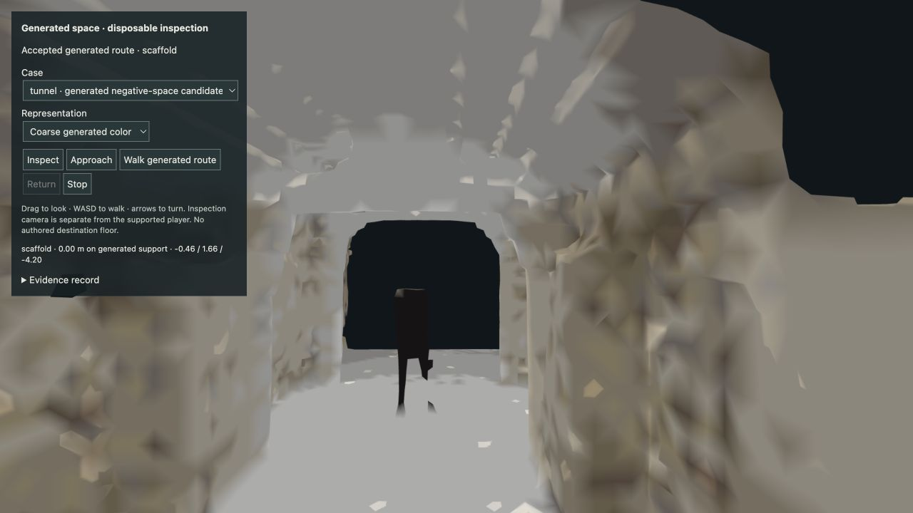
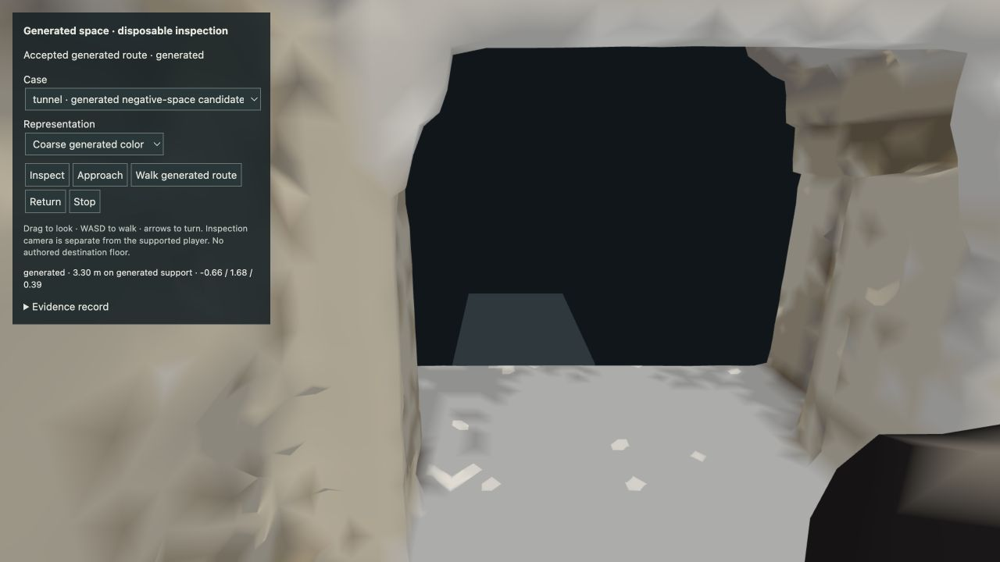
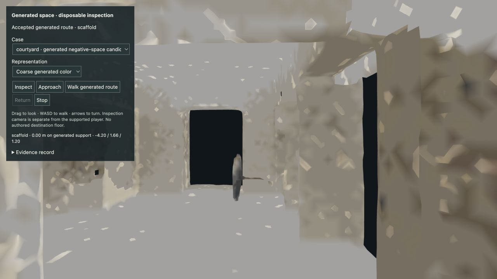
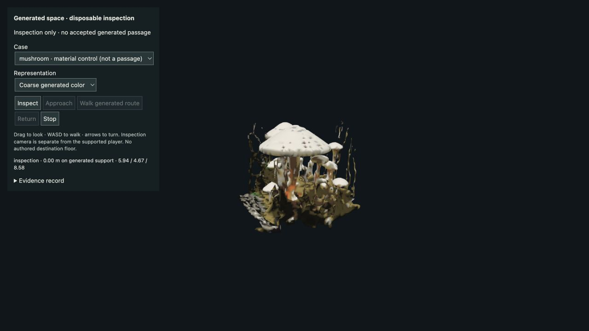
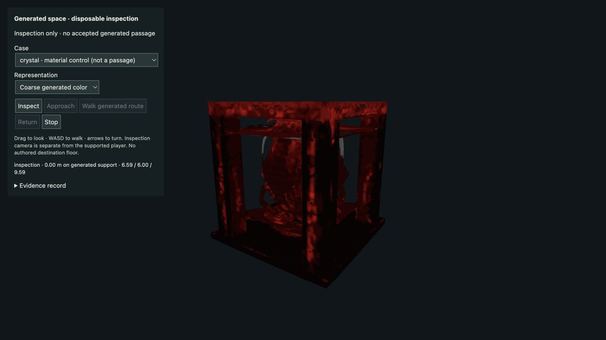

# Generated navigable passage: measured result

2026-09-16 · GitHub #17 · disposable runtime branch `codex/generated-passage-prototype`.

**Yes, within this bounded experiment.** Two of three new intention-generated candidates contain usable interior free space. A browser player entered the generated tunnel and chamber, walked on their original generated surfaces, returned, and reloaded the same destinations after a service restart. The destination floor, walls and openings are generated. Only the external approach is authored. No collider triangles were deleted and no destination floor was patched in.

This proves short generated passages, not dependable room generation or arbitrary world traversal. The image model still inserted unwanted people, the arch candidate failed, and the splats contain view-dependent smearing. Existing intention, M0 and M1 code and storage remain unchanged.

## Executed candidates

The existing Mac intention service recorded each unrestricted sentence and derived semantic envelope before submitting a real GPU job. The unchanged worker `04986defd1de38609cfb69c8d6c78ae4704e5670` ran SDXL-Turbo → TRELLIS serially on the RTX 3090, driver 610.62, 24,576 MiB VRAM. Seed 42, existing model pins and inference settings remained fixed. Full prompts fit the image tokenizer: 67, 69 and 71 tokens respectively. No new weights were downloaded.

| Candidate | GPU wall time | Device peak | Raw mesh triangles | Geometry verdict at scales 6 / 10 / 12 |
| --- | ---: | ---: | ---: | --- |
| Stone arch doorway | 179.59 s | 20,598 MiB | 2,125,234 | fail / fail / fail |
| Short open-ended tunnel | 69.33 s | 16,937 MiB | 664,376 | pass / pass / pass |
| Courtyard/chamber | 76.83 s | 18,132 MiB | 1,431,264 | pass / pass / pass |

The cold first job includes additional startup time. Device peaks include other GPU activity; they are sampled values, not guaranteed instantaneous maxima. [Candidate report](generated-passage-candidates.md) retains exact intentions, jobs, source fidelity, provenance and artifact hashes. All three results, including the rejected arch, remain available locally.

## Collision and support

The old collider was a conservative voxel shell. On the accepted tunnel route it blocked 12 of 73 samples that are clear in the original mesh; it blocked none of the courtyard's 69 accepted samples. That is a collider approximation failure, distinct from a generator failure.

The new experiment derives a spatially indexed triangle collider from **every original GLB triangle**. It does not simplify away troublesome surfaces. The browser and offline assessor use the same `createSurfaceNavigator` implementation, uniform transform and source SHA-256. Display geometry is the existing coarse mesh; original splats are an optional appearance comparison. A 0.3 m radius, 1.8 m upright body moves with bounded steps (0.25 m), slope (35°), swept body/head collision and continuous support checks. Eye height follows generated support instead of staying fixed above an authored floor.

Support uses nine footprint probes and checks their swept paths against the union of original projected support triangles. Each accepted sample records original triangle IDs. The complete disk is used for body collision. Roof evidence must cover all nine footprint probes 1.8–6 m above the feet, or there must be opposing torso-height walls. At least 1 m of the route must be continuously enclosed; a tiny floating patch or distant roof cannot make a floor count as an interior. Regression tests cover both false positives.

Routes require at least 3 m endpoint displacement, original support and reversible movement. Search proposals use a bounded 0.2 m grid; failure means no qualifying route was found within that search, not proof that no conceivable route exists.

The external scaffold ends at a measured generated floor edge. Its support is explicitly marked `-1` and restricted to the exterior half-plane. Crossing the seam can have mixed contacts. Every footprint sample along the accepted interior route has an original, nonnegative triangle ID; the scaffold cannot support those paths. The same movement function crosses the seam in both directions, without snapping or teleportation.

| Smallest accepted scale | Assessed route | Endpoint displacement | Continuous enclosure | Browser forward on generated-only support | Browser round trip |
| --- | ---: | ---: | ---: | ---: | ---: |
| Tunnel, scale 6 | 3.20 m | 3.01 m | 3.20 m | 3.30 m | 6.58 m |
| Chamber, scale 6 | 3.00 m | 3.00 m | 2.48 m | 3.10 m | 6.18 m |

Browser distance includes generated support between the physical seam and the assessed route start. Both walks completed with no blocked steps, invalid support samples, pending visits or browser errors. Tunnel round-trip audit contains 766 movement samples; chamber contains 736. On this Mac, measured navigation plus support-query p95 was 2.8 ms / 2.3 ms, with maxima 7.3 ms / 3.2 ms. These are narrow observed runs, not a general performance guarantee.







## Persistence and acceptance evidence

`evidence/generated-passage/` contains source images, complete generation reports, final geometry assessments, matched rendering screenshots, browser movement audits and restart records. Large PLY/GLB files remain in ignored local artifact storage, identified by SHA-256 rather than committed to Git.

The inspection server was stopped and started again, then the browser reloaded. Complete case records were identical before and after restart: original intent, semantic constraints, world/job IDs, visual/collision hashes, selected assessment, route and crossed/returned events. The browser restored the same chamber with no errors. Starting pose resets to inspection; persistence of the player's exact position is not claimed. No GPU job was resubmitted.

Records bind the full artifact set, assessment, world and intent to one immutable case identity. Browser visit retries carry that identity and a stable event UUID; mismatched identities are rejected. Visit records alone do not prove traversal distance—the movement audits and original-support assessments supply that evidence.

The arch remains inspectable with traversal disabled. Its apparent architectural form did not yield an exterior-entry-to-enclosed-space route under the same rules. We did not carve it open or keep regenerating until it passed.

## Coarse generated color experiment

The new abstract variant transfers local Gaussian SH-DC RGB samples to the unchanged coarse mesh and compresses them to a separate palette of up to 12 colors per artifact, using the same algorithm. It preserves large color/value regions and rare chromatic accents, without inferring emission, transparency or real material physics. Renderer gamma handling matches the generated colors. Geometry hashes, palette, source hashes and projection statistics are retained in the color reports.

Initial quantization lost the mushroom's orange cue even though 14 mesh vertices retained orange in their local samples. A general chroma-aware palette distance fixed that loss; the regression fails with the earlier palette. The final mushroom has 17 orange-assigned vertices and distinct pale caps/olive ground. Crystal red identity survives strongly. Both improve on the uniform control. The orange stem accent survives; the splat’s stronger glow appearance is not recovered. No emitted light is inferred, and small detail is still lost.

All mushroom vertices and all three new candidates' display vertices matched nearby generated samples. Crystal matched 54,002 of 54,562 vertices; 560 receive an explicit neutral fallback. Projection uses bounded spatial representatives, not exact texture recovery. The same algorithm/settings apply to every artifact.





Uniform/coarse/original screenshots use matched camera poses. On the tunnel, original splats smear across the entrance when viewed from inside; the coarse mesh gives a clearer opening that agrees with collision. This is a reason to retain mesh-based abstract rendering, not evidence that splats and collision agree everywhere.

## Reproduce on this Mac

On `codex/generated-passage-prototype`, existing local artifacts are sufficient; no GPU is needed to reopen accepted spaces:

```bash
npx tsx scripts/prepare-passage-inspection.ts
npm run passage
```

Open `http://127.0.0.1:5176/generated-passage.html#tunnel`. Select **Approach**, then **Walk generated route**, then **Return**. These development controls feed small displacements through the same collision-constrained movement as WASD. **Inspect** and **Approach** deliberately reset the inspection/start pose; they are not traversal evidence. Drag to look, WASD to explore, and use the representation selector for matched comparisons. The separate service is on Mac loopback 4312. Existing intention service/worker ports are unchanged.

Reassess an original candidate without inference:

```bash
npx tsx scripts/passage-geometry.ts \
  --glb .runtime/generated-passage/candidates/tunnel/collider.glb \
  --out .runtime/generated-passage/reassessment/tunnel.json \
  --scales 6,10,12
```

Changing an accepted assessment or any artifact intentionally invalidates persisted case identity. Preserve existing evidence and create a separate experiment record for a different assessment. The declared generation batch is `scripts/run-passage-candidates.py`; its saved job IDs prevent duplicate jobs when resumed. Setup and exact remote paths remain in `intention-generation-gpu-setup.md`.

Validation: `npm run check:passage` passed (33 existing tests, 24 passage/color/service tests, typecheck and both builds). Independent review reproduced and closed the enclosure false positive, stale visit identity gap and representation-loading race. The reviewer independently replayed the real tunnel's forward and reverse route with zero blocked segments.

## Decision

TRELLIS is capable of this small generated passage; reliability remains the research problem. The conditional WorldGrow/HunyuanWorld switch was not triggered by this batch because two new candidates pass and were physically traversed. Neither alternative was GPU-benchmarked or downloaded in this slice. Keep their scene-generation benchmark as the fallback if broader candidate testing stops yielding usable spaces. Do not expand gameplay or treat this as general world-generation readiness.
