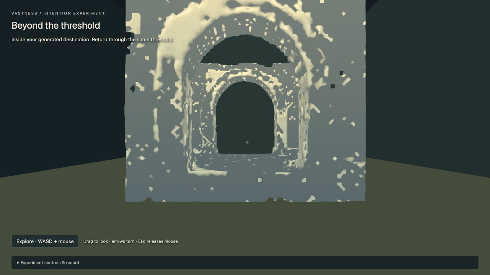
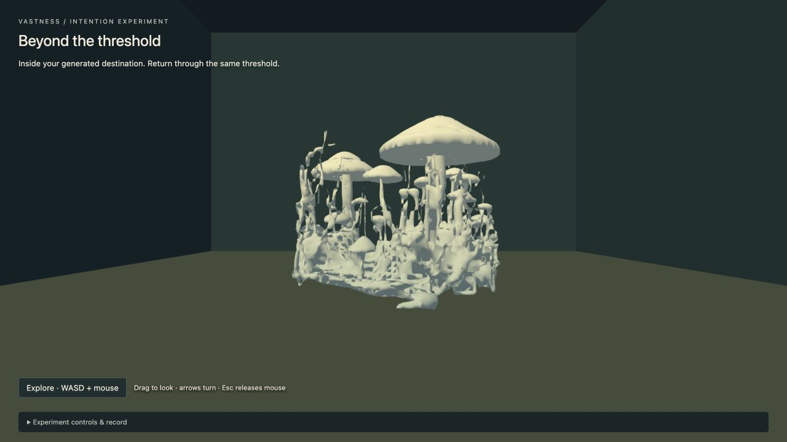
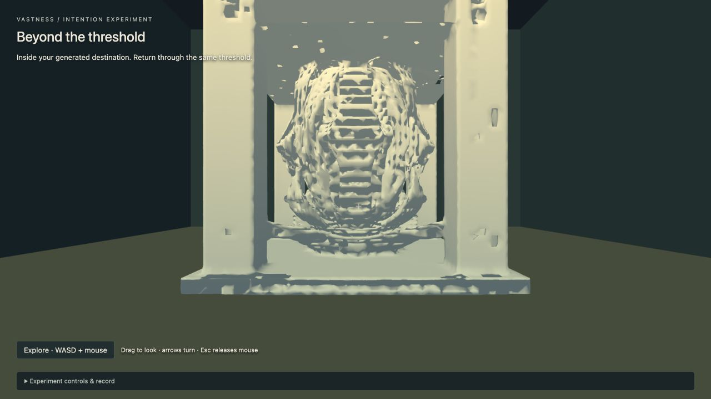
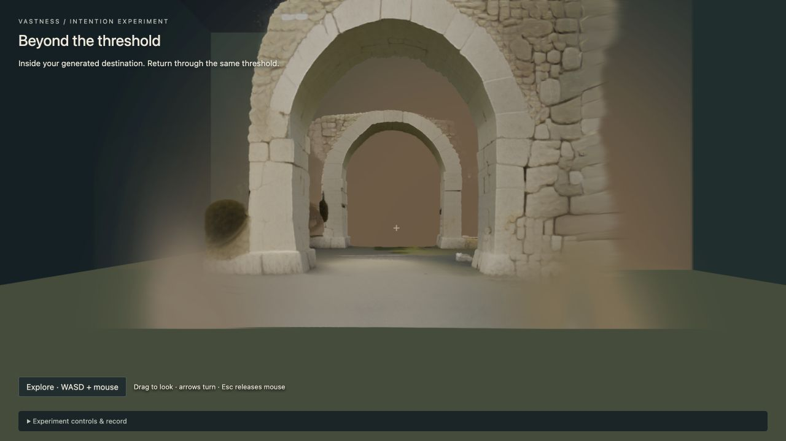
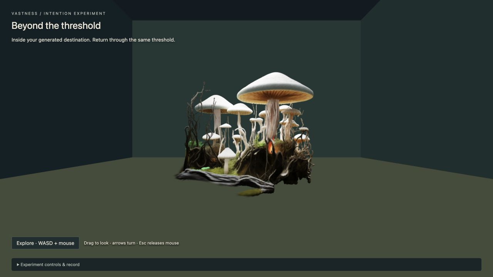
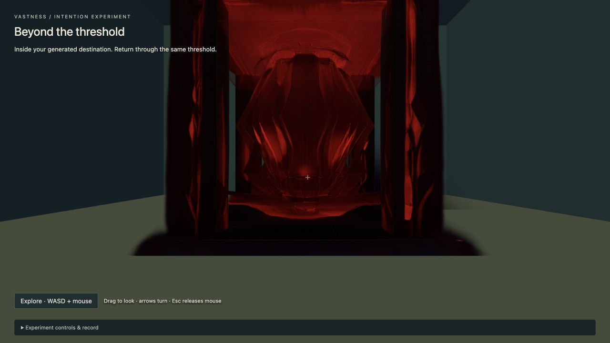

# Intention-generated destination — experiment record

Question: “Can I ask the world for something that was not pre-scripted, then physically enter what it creates?”

**Measured answer: the causal generation-and-entry loop works for an artifact inside an authored destination.** Three unrestricted text requests produced distinct real RTX 3090 outputs. Each was validated, rendered, crossed into, circled with collision, returned from and restored after restart without regeneration. This is not evidence of three fully generated walkable interiors: the support floor and outer room remain authored, and an apparent opening can still be blocked by generated collision. Semantic fidelity is mixed, strongest for recognizable objects and weaker for material, atmosphere and usable interior space.

This disposable experiment is isolated on `codex/intention-generation-prototype`. M0 and the earlier M1 experiments retain their code, storage and accepted artifacts. GitHub ticket: [#16](https://github.com/sebboseb/vastness/issues/16).

## What the experiment tests

A player approaches one closed threshold, types an unrestricted intention, and submits it. The Mac persists the original sentence and a versioned semantic envelope before contacting the worker. A small rule-based compiler extracts scale, density, mood and openness while retaining unfamiliar concepts. It does not select among a catalogue of destinations. The text input is one `InputSource` adapter; voice can provide the same text/source envelope later.

The worker converts the envelope into an image prompt. SDXL-Turbo generates the source image on the RTX 3090, a color matte or explicit full-frame fallback prepares the image, and TRELLIS generates Gaussian PLY and a triangle-mesh GLB in a separate CUDA process. The Mac verifies both artifact hashes and sizes, rejects malformed or excessive geometry, applies a fixed scale, derives conservative surface collision and verifies an entry/perimeter/return route. Only then, and after the browser renders the mesh, does the threshold open.

Both original splat and abstract solid are available. The latter holds the palette constant across requests, making geometry differences visible without treating malformed texture as failed realism. The floor, enclosing support walls and threshold remain authored. Walking around the generated asset is established separately from navigating a generated room interior.

## Controlled comparison

All comparison runs use seed 42, the same model pins, four SDXL steps, twelve TRELLIS sampler steps and the same authored placement/scale. Inputs differ; there are no trial-specific code paths or fixture replacements. Exact original sentences, derived axes, prompt token counts, job identities, timings, hashes and movement evidence are retained alongside this report.

## Results — final pipeline

All three final jobs used deployed worker commit `04986defd1de38609cfb69c8d6c78ae4704e5670`, backend `sdxl-turbo-trellis-intention-v3`, on an RTX 3090 with 24,576 MiB VRAM and driver 610.62. The exact job IDs, raw sentences, axes, artifact hashes and recorded movement are in [summary.json](evidence/intention-generation/summary.json). Full source images, generated prompts and reports are under `evidence/intention-generation/comparison1` through `comparison3`.

| Intention | Derived axes | Worker wall time | Sampled device peak | Display triangles / collider boxes | Measured round trip |
| --- | --- | ---: | ---: | ---: | ---: |
| Enormous, quiet pale stone arch above a still lake | vast / sparse / quiet / open | 221.70 s, cold start | 16,629 MiB | 40,924 / 816 | 79.60 m |
| Dense tangled garden of giant glowing mushrooms and roots | vast / dense / luminous / mixed | 75.65 s | 17,029 MiB | 33,728 / 1,496 | 93.22 m |
| Compact enclosed chamber of sharp red crystal, dark and ominous | intimate / balanced / ominous / enclosed | 119.42 s | 24,233 MiB | 126,551 / 2,093 | 96.13 m |

Worker wall time includes file verification, loading, inference and export, not just GPU kernels. The cold arch took 227.06 seconds from Mac intent recording to validated readiness; the garden took 78.74 seconds. Crystal initially failed the Mac size budget after successful generation, so its observed 426.71 seconds to readiness includes development and validation-retry delay; it is not a steady-state latency measurement. Independent crystal preparation took 5.77 seconds, with 679 MiB peak resident memory and zero swaps. The cold WSL job had 31 GiB guest memory and zero swap-in/out counters; its delay was concentrated in integrity checks/startup/model loading.

Prompt lengths were 55, 48 and 50 tokens against a 77-token limit, with no truncation. Garden and crystal used explicitly recorded unsegmented full-frame conditioning; their backgrounds could become geometry. Crystal reached within 343 MiB of total device memory in the 100 ms samples. Whole-device samples include other processes and can miss peaks. It succeeded, but that is little headroom and does not establish reliability for arbitrary prompts. All heavy jobs ran one at a time.

## Visual comparison

These are matched browser views at `[0, 1.65, -13]`, looking toward the result, with the same authored room, scale and camera. The abstract treatment changes appearance, not source identity, placement or collision.

| | Quiet arch | Glowing garden | Red crystal |
| --- | --- | --- | --- |
| Abstract solid |  |  |  |
| Original splat |  |  |  |

- **Arch:** stone arches survive, but the single arch becomes nested arches. The lake and open sky do not survive clearly. Solid rendering makes its ragged/perforated surfaces conspicuous.
- **Garden:** mushroom caps, dense stems and tangled roots are clearly recognizable in 3D. The splat retains greenery and a localized warm glow. The solid retains silhouettes and density but loses much of the luminous/material intent. This is the strongest semantic result, though it reads as a diorama rather than an enormous landscape.
- **Crystal:** the splat retains deep red, dark contrast and some faceted structure. The solid loses those defining cues and reads as a pale ribbed object inside a frame. Neither establishes a usable chamber interior.

These are inspection judgments, corroborated by an independent visual review, not a human playtest. We did not isolate each semantic axis in an ablation: nouns and the retained concept may dominate the axis words. No claim is made that “vast” and “intimate” produce reliable metric-scale differences.

## Acceptance and interpretation

Actual browser actions covered approach, text entry, submission, waiting behind a closed gate, artifact rendering, collision-constrained crossing/circuit/return, selecting earlier destinations and reload. Each measured round trip ended with zero overlap and no pending visit writes. Crossing events are persisted with unique retry identities. [Restart evidence](evidence/intention-generation/restart.json) records byte-identical world records after restarting the Mac service, ready status, saved crossing/return events, unchanged artifact hashes and exactly one GPU submission per final destination. Browser restoration evidence is recorded separately for all three cases.

This is causal agency at the request/artifact level: the player supplies an open concept and real inference creates new geometry, without a fixed destination lookup. It currently feels structurally closer to requesting a persistent spatial exhibit than reshaping an entire explorable environment. The wait and authored support space limit the fantasy. Whether it emotionally feels like shaping reality remains a user-playtest question.

A useful next experiment is to retain coarse semantic material/color cues inside the abstract-solid treatment, while separately testing whether generated openings correspond to navigable free space. Neither a final art style nor a larger gameplay system is selected here.

Verification: `npm run check:intention` passed all 33 existing tests and 21 isolated tests, typecheck and both builds. Worker discovery ran 41 tests: 37 passed and four skipped on the Mac (two existing GPU-only tests and two Pillow-dependent tests). All six isolated contract/Pillow tests passed in the actual remote environment. Three final real GPU reports establish NVIDIA execution independently of those test skips. [Isolation hashes](evidence/intention-generation/isolation.json) confirm the M0 database and earlier M1 page, runtime, preparation script and scene remained unchanged; the Git diff also leaves existing M0/M1 source untouched.

## Reliability and limitations

The Mac world record persists intent, constraints, worker request, job identity, accepted artifact manifests and crossing history. Worker transport failures remain resumable. Restart reconciles a job whose submission acknowledgement was lost. Accepted destinations do not regenerate. Crossing IDs distinguish fresh visits after reload from retried HTTP requests.

The compiler is a bounded English lexical extractor, not a general semantic reasoner. The retained concept is at most 600 characters, and the image model has a CLIP token limit; actual truncation is measured. Scale words influence the image prompt, but physical scale remains a fixed six metres per model unit in this experiment. Quiet is a visual request; audio is absent. The color matte can erase very pale material and retain a nonwhite backdrop.

The original U2NetP smoke completed CUDA inference but removed much of the requested arch during masking. It is preserved as a visual quality failure. A later mushroom image matched the request but filled the frame, so the first white-matte policy rejected it before TRELLIS. The final general policy preserves full-frame RGB conditioning with transparent padding when no white backdrop is present; it records that the background is unsegmented. All final comparison requests use that same pipeline. Exact setup and failures are documented in [GPU setup](intention-generation-gpu-setup.md).

The first free-form arch also exceeded the initial one-million-triangle Mac parser limit. Its 1,184,866 triangles fit the existing byte and sampling budgets, so the bounded triangle limit first became two million while the one-million-vertex, 64 MiB GLB and six-million-sample limits stayed in force. A real-artifact test verified the resulting 40,889 display triangles and 806 collider boxes. Revalidation reused the same GPU job and hashes; the rejection remains in its event history.

The subsequent crystal output required the final measured bounds: 256 MiB PLY, four million splats, two million vertices, four million triangles and twelve million surface samples. The 64 MiB GLB limit, finite coordinate limits and entry/route checks remain unchanged. Its 3,005,700 source triangles produced 126,551 display triangles, with 9,017,100 samples and 2,093 collision boxes. Actual original-surface coverage and blocking are regression-tested; no collider was removed to force acceptance.

A direct center-line walk toward the first apparent arch opening stopped at z=-17.58. That is useful negative evidence: a visually open generated arch is not automatically a traversable interior. The validated destination circuit goes around the asset, not through its inferred walls.

## Reproduce locally

Use the committed worker deployment and SSH commands in the GPU setup note, then run `npm run intention` on this prototype branch. Open `http://127.0.0.1:5175/intention-generation.html`. Walk toward the threshold with WASD/mouse, or use the temporary “Walk to threshold” control. Submit free-form text near the seam. After readiness, walk normally or use the collision-constrained circuit and return controls. Saved destinations are available under the temporary experiment controls.

`npm run check:intention` covers existing checks and this prototype. Worker CPU checks use `python3 -m unittest discover -s services/gpu-worker -p 'test*.py'`; actual CUDA measurements are separate evidence, never inferred from skipped tests.
