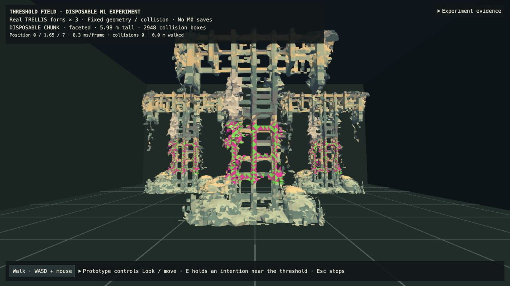
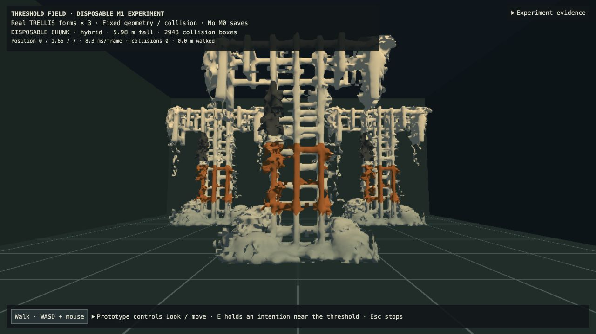
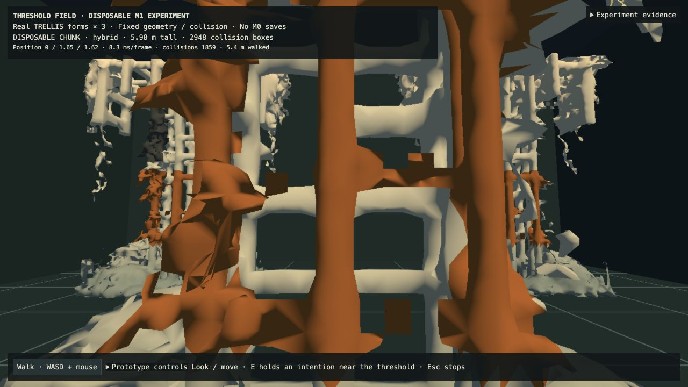
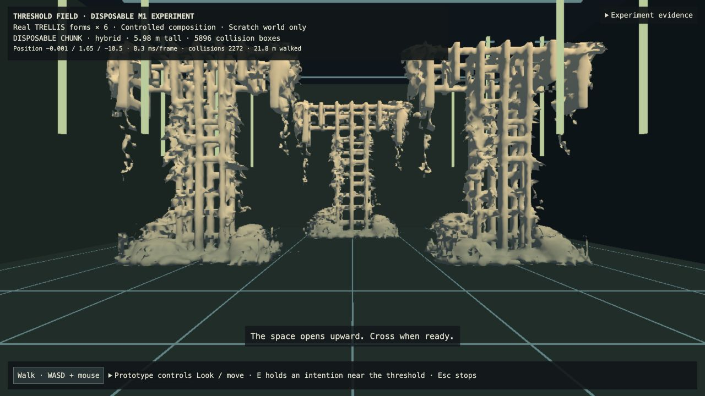
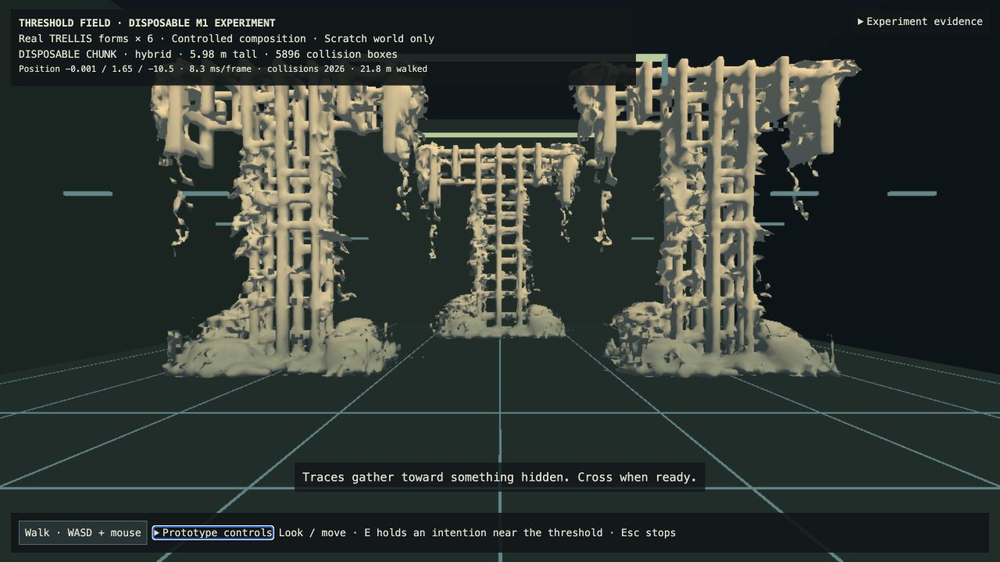
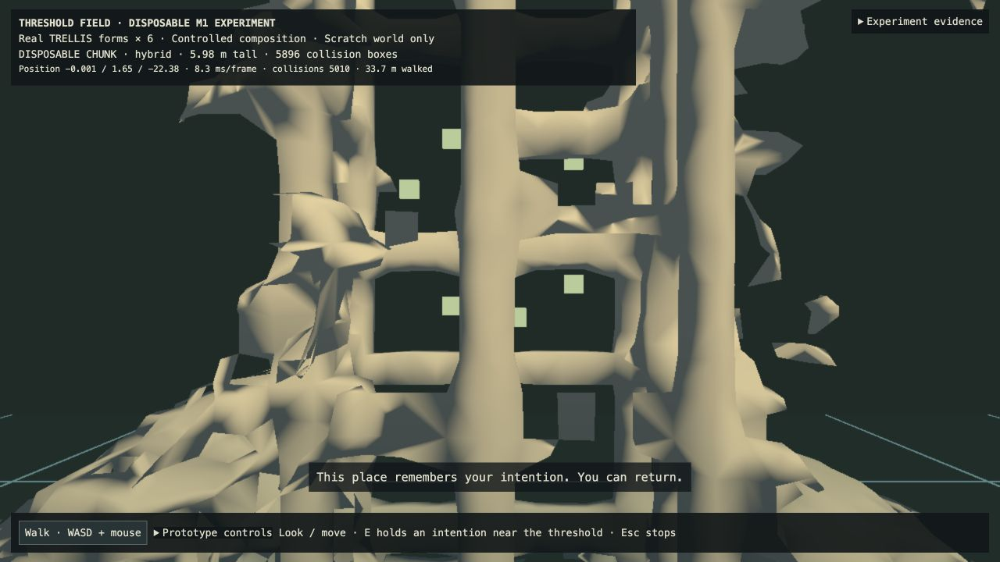

# M1: solid forms, sparse marks and intention at a threshold

This disposable experiment answers two separate questions. The solid treatment improves legibility under controlled material faults; sparse glyphs preserve solid-versus-passable cues but add only a subtle sense of mystery. The intention loop works causally and spatially, but it is not yet evidence that players experience broad creative agency.

Run `npm run m1` on `codex/m1-intention-prototype`, with the verified local benchmark artifacts present. Open http://127.0.0.1:5174/m1-prototype.html?variant=hybrid&stress=1 for the style comparison, or http://127.0.0.1:5174/m1-prototype.html?variant=hybrid&experiment=intention for the threshold loop. Prototype controls contain repeatable walk/camera/reset actions; ordinary use is WASD, mouse/drag and E near the threshold. Controls are collapsed in the intention experience. No prompt box or destination menu was added.

## 1. Solid-and-glyph treatment

The comparison keeps the exact prepared base mesh, scale, three placements, floor, camera and collision fixed. The original TRELLIS outputs and derived scene remain unchanged. The base contains 11,063 vertices and 24,624 triangles per instance. Broad solid shading replaces per-face palette noise with a restrained height/value gradient; smooth normals are a shading change, not new geometry. The hybrid adds 48 anchored glyphs (192 small stroke triangles) per instance. They use depth testing, surface orientation, distance and facing fades. These marks are overlays, not replacements for solid mass.

A deterministic stress mask covers 2,328 existing faces per instance: 1,529 with corrupt material and 799 with unfinished material. The faceted control shows alternating magenta/green and flat gray faults. Broad solid/hybrid interprets the same face membership as ochre repair and dark unfinished patches. Overlays repeat the original face positions/indices with depth bias; the base mesh and collider remain intact. This tests material inconsistency, not repaired topology. Existing ragged edges, floaters and coarse foliage remain visible.

| Observation | Verdict |
| --- | --- |
| Solid mass and paths | Broad values make the main form easier to read than the noisy faceted control. Floor lines disappear behind solid mass; glyphs do not turn obstacles into transparent clouds. |
| Deliberate faults | Restricted patches read more like altered material than a broken texture. The rectangular mask and repeated patches are still conspicuous. Recoloring does not make every defect intentional. |
| Glyph contribution | Subtle at the entrance and more apparent at suitable nearby surfaces. Marks may be occluded or fade away; eligible-mark telemetry is not a count of visible screen pixels. The hybrid's added mystery is weaker than the earlier glyph-only cloud. |
| Close range | Jagged silhouettes and stretched coarse faces remain. Thin strokes can alias; a mark plane can extend beyond its anchor face. Depth testing/fading reduces confusion but does not repair geometry. |
| Navigation | The same real obstacle stop and returning circuit still work. Nothing was removed from collision to make the style succeed. |

Matched 1280×720 front, side and near-obstacle captures compare faceted, broad-solid and hybrid treatments. Front: `[0,1.65,7]`, yaw 0/pitch 5. Side: `[6.8,1.65,0]`, yaw 90/pitch 8. Near: `[0,1.65,1.62]`, yaw 0/pitch 5, reached through actual walking until collision stopped movement. The hybrid's live circuit returned after 28.69 m without adding collision frames; deterministic checks returned after 28.92 m. Frame intervals were about 8.3 ms median in these captures, not measured GPU render time or a controlled performance benchmark.

**Provisional conclusion:** retain broad solid values as the useful navigation foundation. Sparse glyphs can coexist with it, but this trial does not establish that they alone make ugly generation mysterious or intentional. Cross-asset inconsistency and serious topology failure remain untested. This is an investigation result, not a permanent art style.

## 2. Intention → threshold → next space

The player walks around generated forms toward an authored seam. Before crossing, look upward for **Ascend** or toward the opening for **Seek**, press E, and sustain that gaze category for 1.1 seconds. Moving out of reach, changing category, or Escape cancels before recording. The cue is contextual; the action does not open a destination menu. A 1.8-second formation retracts the visible veil; collision remains closed until the result is ready.

The prototype world records the intention, structured semantic constraints, seed, resulting composition and causal events. The fixture composer receives semantic axes, not an intention name or level id:

- Ascend emphasizes vertical rhythm and upper openness. Light traces extend upward and overhead marks sit higher; it does not promise stairs or a climbable floor.
- Seek emphasizes a concealed focus and detail revelation. Lower overhead traces draw attention inward; fragmented marks on the far wall fade into view as the player approaches.

Both use the same destination shell, floor, three generated-asset placements and collider. Only authored non-solid traces above body height or flush with the far wall respond. This is a controlled composition of existing real TRELLIS assets, not a newly generated environment or boundary-conditioned inference.

A dedicated `vastness:PROTOTYPE-wipe-me:intention-v1` sessionStorage record persists the scratch world across same-tab reload. It is not the production world database and does not promise persistence after closing the tab. Pose resets on reload; the accepted composition remains. Once crossed, the intention cannot be changed on return. “Reset scratch world” is a developer action affecting only this experiment. There are no M0 world/player API writes.

The final browser run exercised both choices from the same closed-seam contact at `[-0.001,1.65,-10.5]`. Ascend used actual drag-look to pitch 32.4° followed by E; Seek used level gaze and E. A forming-state capture contains only `intention-recorded`, before `composition-ready` and before crossing. The periodic movement telemetry in that single transitional capture is one sample behind the authoritative world record; both are retained rather than rewritten.

Each result opened onto the same destination. Actual walking crossed the seam and stopped at the next generated obstacle at `[-0.001,1.65,-22.38]`, with no overlaps. Seek's far-wall fragments became visible through the form on approach. Return travel crossed the same seam back to `[0,1.65,-9.067]` for Ascend and `[0,1.65,-9.087]` for Seek; the event sequence is `intention-recorded → composition-ready → crossed → returned`. Both records survived reload byte-for-byte; pose reset to the entrance while each accepted composition stayed intact. Reset after Seek returned to an unshaped world without a renderer error. No regeneration occurred. Collision-frame totals include deliberate sustained pushes into the closed seam and generated obstacles, not penetrations.

The two ready-state screenshots have identical position, yaw, pitch and viewport. They show atmospheric/compositional influence, not different physical levels. The raw contact view of the closed veil fills the screen when pressed against it; the approach view communicates the opening more clearly. This is another reason not to treat the current interaction as finished design.

**Agency assessment:** the causal chain is real: an embodied gesture at the seam changes the space ahead, the world records why, and the result persists when revisited. Because both responses alter the same shell and no destination names/cards appear, this is less like choosing a level. However, two deterministic gesture categories still form a binary choice, and the changes are atmospheric rather than new navigational affordances. The obvious cue explains causality; it can also make the interaction feel like a disguised selector. This is a promising agency mechanism, not a validated feeling of unrestricted authorship. No player study was performed. The next useful test would be whether a player can infer the consequence without the explanatory sentence; it should not expand the gameplay system yet.

## Verification and isolation

`npm run check:m1` passes 33 tests with none skipped, typecheck, the M0 build and isolated M1 build. Tests cover uploaded base mesh buffers, exact fault membership, glyph visibility rules, real generated collision through both intentions, seam contact, recorded causality, reload serialization, immutable accepted results, detail revelation and reset after Seek. Independent standards/spec reviews found and helped resolve seam-contact and reset issues. The existing bundle-size warning remains.

M0 renderer/player/orchestrator/shared protocol and its database are unchanged. All experimental runtime remains on `codex/m1-intention-prototype`; integration receives the spec and evidence only. No GPU jobs, downloads or remote deployment were performed in this experiment.

[Capture states and complete causal records](evidence/m1-intention-threshold/captures.json) · [Verification and isolation](evidence/m1-intention-threshold/verification.json) · [File hashes](evidence/m1-intention-threshold/hashes.json). Runtime source: `bd2000931a851bbdeb17ceb8ec3067c0347a1883`. Style captures omit the inactive scratch-world record; threshold captures include it. The 23 captures and evidence hashes were checked for camera matching, causal ordering, reload equality and M0 isolation.
