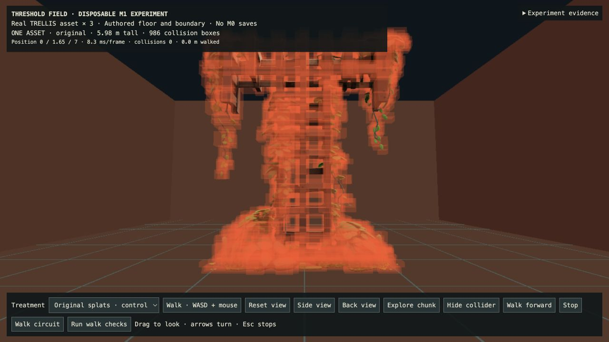
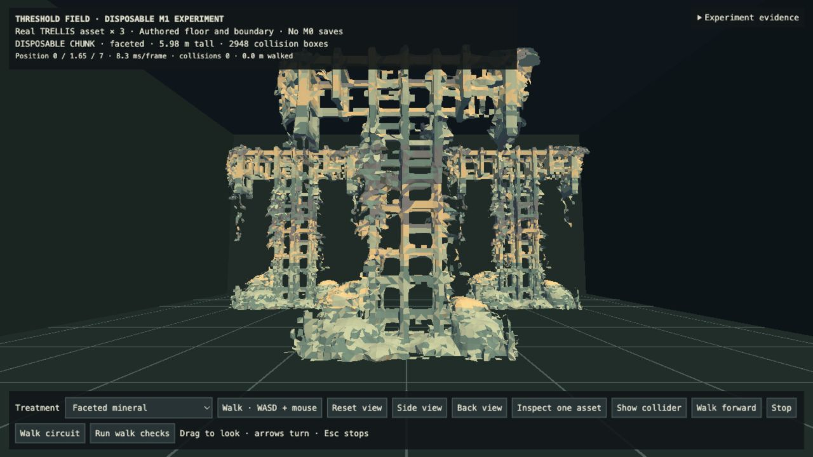
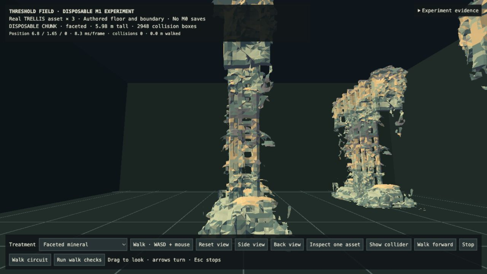
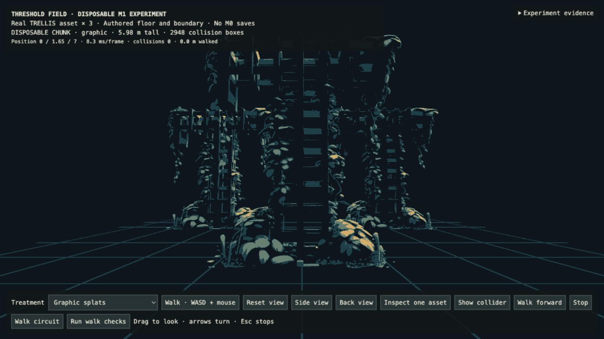
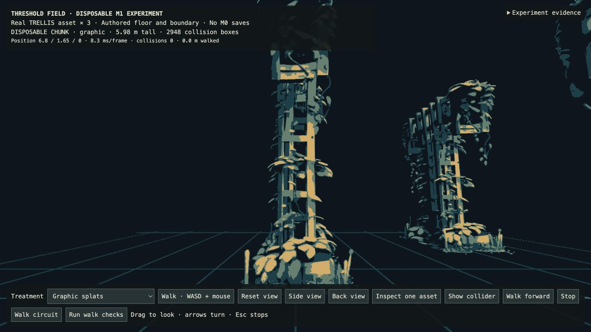
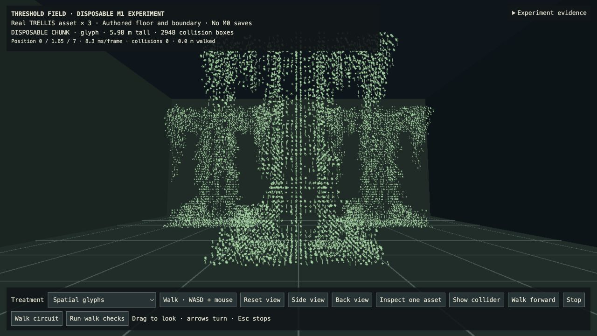
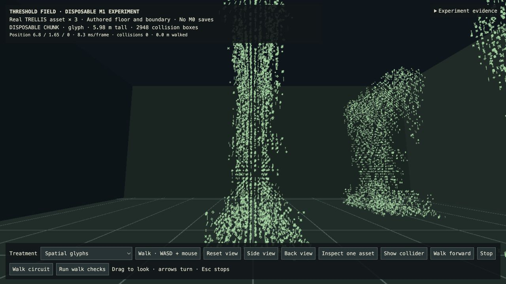
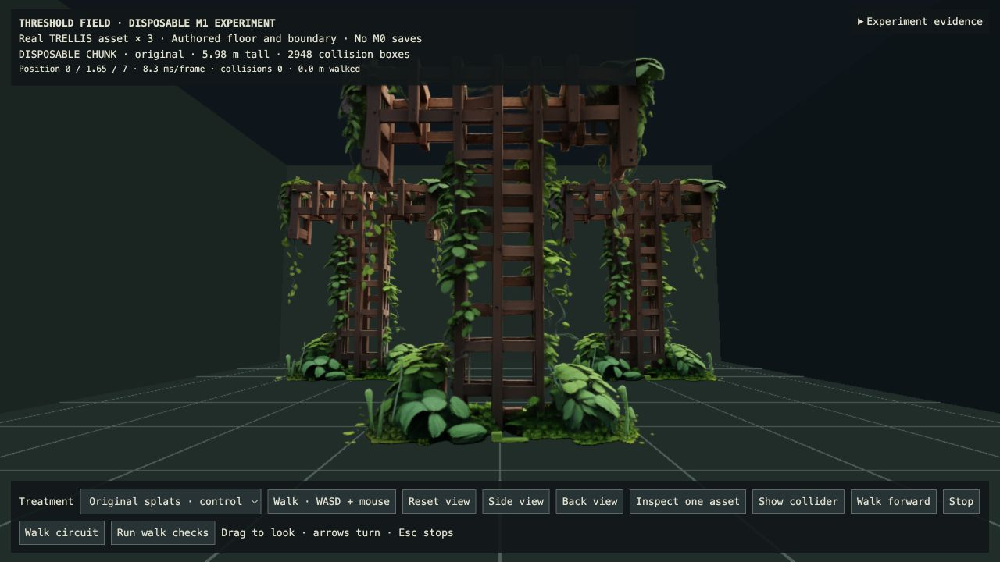
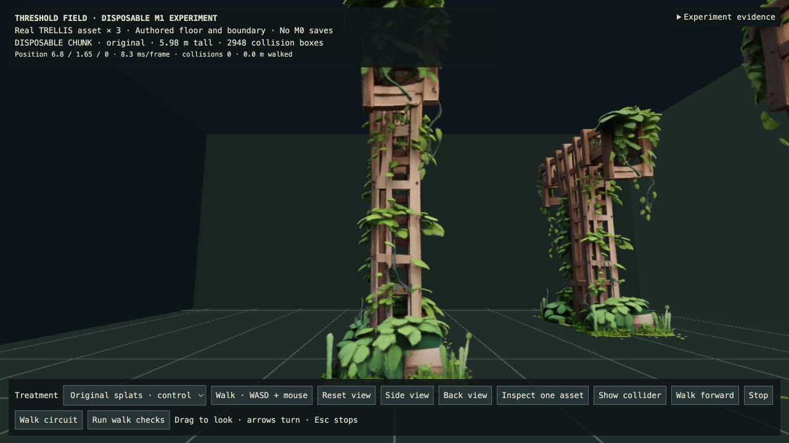
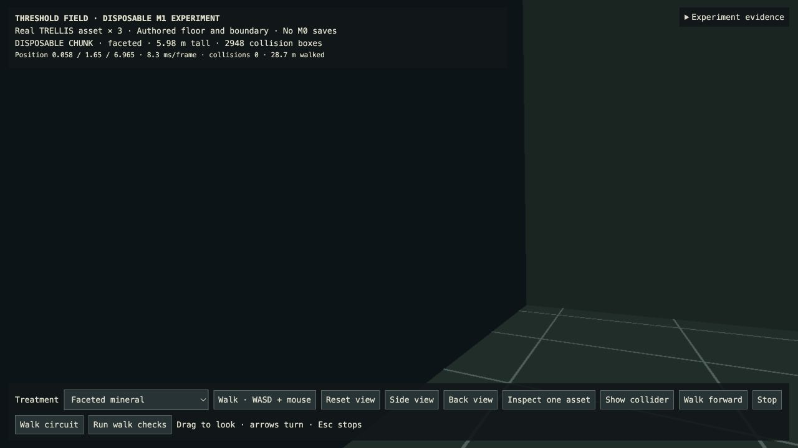

# M1: walkable threshold field and abstract representation comparison

The disposable chunk is walkable. It uses three instances of the actual TRELLIS-generated asset from job `trellis-smoke-20260915-03`, derived collision, an explicitly selected scale, and a labeled authored floor/perimeter. The player can approach a generated obstacle, stop against it, walk around the forms and return. This is a composed generated-asset chunk; TRELLIS did not generate its layout or support floor.

The experiment is retained on branch `codex/m1-inspection-prototype`, separate from the M0 implementation. Verified runtime source: `2ad6c7bf4f1601e0fb1878816cf5479570403b1a`. Check out that prototype branch in the existing workspace (the verified benchmark artifacts must be present locally), run `npm run m1`, then open **http://127.0.0.1:5174/m1-prototype.html**. The default is faceted geometry. The selector exposes graphic splats, spatial glyphs and original splats; `?variant=faceted|graphic|glyph|original` makes the representation shareable. “Inspect one asset” isolates the first instance. WASD and mouse/drag move/look; arrows turn, Escape stops. Simple forward/circuit controls allow repeatable observation. Pose remains in memory; reload resets the experiment.

## Spatial and collision result

Both original file sizes and SHA-256 hashes are verified before preparation. The original PLY remains unchanged. `scene.json` contains derived mesh arrays, glyph positions, collision boxes, source identities, explicit transform and caveats. `npm run check:m1` regenerates it before checking, preventing stale collider data from passing the movement tests.

| Property | Measured result |
| --- | ---: |
| Source mesh triangles | 634,834 |
| Clustered visual mesh triangles | 24,624 (96.12% fewer) |
| Source / simplified vertices | 317,222 / 11,063 |
| Model units to metres | 6, selected for this experiment |
| Grounding translation Y | 2.9976301789 m |
| Resulting asset height | 5.9807 m |
| Surface voxel pitch | 0.12 m |
| Maximum triangle sampling spacing / padding | 0.06 m / 0.06 m |
| Occupied cells → merged boxes per asset | 12,985 → 981 |
| Box-equivalent triangles per asset | 11,772 (98.15% fewer than source) |
| Surface glyphs per asset | 3,500 |
| Chunk solids | 2,943 derived boxes + 5 authored support/perimeter boxes |

Vertex clustering simplifies appearance. Collision is derived independently from the original mesh: every triangle is sampled with conservative padding, then adjacent occupied cells are merged. It includes foliage; no geometry was erased to manufacture a passage. The shell is not a watertight interior volume and does not infer floors, slopes or step heights. Quantization can overblock small gaps. The flat-floor walker remains at 1.65 m eye height with 0.3 m radius; jumping, climbing and uneven terrain are outside this experiment.

The chunk uses translations `[0,0,0]`, `[-4,0,-6]` and `[4,0,-6]` for all treatments. Bounds are authored at X −9..9, Z −11..9. A visible grid supplies stable distance/depth cues. An individual asset's bounds are approximately `[-2.698,0,-1.321]..[2.617,5.981,1.250]` metres. A side recess at X −2.6 is traversable even though the player center lies inside the original overall AABB; the capsule extends beyond that edge. This is not an interior doorway. The central mass remains blocked.

## Walkability evidence

- Browser forward walking stopped at `[0,1.65,1.62]` against actual derived foliage, after 5.38 m of travel from the entrance. Continued forward input increased collision frames without penetration.
- Browser checks stopped the perimeter approach at X 8.5, preserving the 0.3 m radius inside the boundary at X 8.8.
- The live circuit traversed approximately 28.84 m around the three forms and returned to `[0.034,1.65,6.980]` with no overlaps. A final faceted-mode live run also returned: 28.71 m, ending `[0.058,1.65,6.965]`, zero collision frames and no overlap. Small distance differences reflect frame steps and the 0.09 m waypoint tolerance. Its path passes around the generated central form, between it and the rear instances, and back to the entrance.
- Deterministic movement checks completed the same route at finer steps (28.92 m) without overlap and passed with the same collider in every inspected treatment. A rendered screenshot alone was not counted as collision validation.
- `npm run check:m1` passed typecheck, all 26 local tests (none skipped), M0 build and the separate M1 build. Tests cover corrupted-source rejection, scaled/grounded surface coverage, actual asset recess/obstacle behavior and the returning chunk circuit. The existing PlayCanvas bundle-size warning remains.
- The M0 database SHA-256 is unchanged. M0 renderer/player/orchestrator/protocol source is unchanged; no world or player API writes exist in the prototype. Generated files use a separate ignored asset directory and do not enter the ordinary M0 build.

[Final live circuit](evidence/m1-threshold-field/final-live-circuit.json), [browser collision checks](evidence/m1-threshold-field/browser-walk-checks.json), [live circuit](evidence/m1-threshold-field/live-circuit.json), [capture states](evidence/m1-threshold-field/capture-states.json), [derivation](evidence/m1-threshold-field/derivation.json), [artifact hashes](evidence/m1-threshold-field/artifact-hashes.json), [verification](evidence/m1-threshold-field/verification.json), [M0 isolation](evidence/m1-threshold-field/m0-isolation.json).

## Matched visual comparison

All views use the same source, transform, instances and collider. Final comparison captures use a fixed 1280×720 viewport: front `[0,1.65,7]`, yaw 0/pitch 5; side `[6.8,1.65,0]`, yaw 90/pitch 8. The viewport override was only for matching evidence. These are qualitative observations from one generated asset, not a user study or proof of robustness across models.

| Treatment | What works | What failed or remains uncertain |
| --- | --- | --- |
| Faceted mineral | Broad solid shape and base remain legible. Fragmented leaves become mineral-like facets, making imperfect geometry plausible as an abstract structure. | Per-face palette changes create camouflage and visual noise. Close silhouettes can lose fine features through clustering. |
| Graphic splats | A restricted five-band value/color palette gives the whole scene a shared atmosphere and suppresses much of the original material detail. | Dark values merge solids with the background and make depth harder to judge. This is a whole-canvas post-process: it also recolors the authored floor/grid, so it is not a strictly asset-only appearance comparison. |
| Spatial glyphs | Strong incomplete-representation/ASCII-city feeling. Geometry reads as assembled marks and suggests mystery without demanding realistic surfaces. | Transparency reveals grid lines through collidable masses; marks from front/back surfaces compete. Solid-versus-passable cues are weakest here, despite identical correct collision. This representation alone is unsuitable for the current walking task. |
| Original splats, control | Most recognizable wood/foliage and coherent detailed surfaces; establishes the original bytes really load in the browser. | Literal trellis repetition and realistic detail narrow the imaginative interpretation. Small floating details remain exposed. This is a control, not a selected style. |

### Faceted geometry

### Graphic splats

### Spatial glyphs

### Original control

Frame telemetry measures browser update intervals, not GPU render duration. Final matched observations were approximately 8.3 ms median; earlier browser sizing/background conditions produced approximately 33.3 ms. This variation prevents a reliable speed ranking. Source loading was cached in these captures. Controlled cold-load, memory and render-time measurement remain separate work; no new NVIDIA generation timing is claimed.

## Provisional branch decision

[Ticket #14](https://github.com/sebboseb/vastness/issues/14) investigates **broad abstract solid forms with sparse spatial glyph accents**. Start from the readable mass of the faceted treatment, reduce its per-face color noise, and test whether glyphs can add ambiguity without making obstacles appear passable. Keep faceted-only as the control. This combines the strongest observed spatial cue with the most promising emotional cue; it does not select a permanent visual style.

The next experiment should deliberately stress a mismatched or incomplete visual detail while holding geometry/collision fixed. The current asset's foliage, small floaters and coarse simplification supplied limited inconsistency; three instances of one asset do not establish cross-asset coherence. Preserve that uncertainty instead of claiming the representation already tolerates arbitrary generation errors.

The creative direction remains in [creative-direction.md](../creative-direction.md): “Anything could be beyond the next threshold, and the world can become what I intend.” No intention mechanic or broader gameplay design was added in this milestone.
