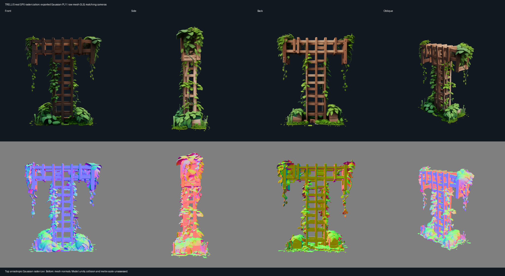

# First TRELLIS appliance trial — 2026-09-15

**Succeeded:** job `trellis-smoke-20260915-03` ran genuine CUDA image-to-3D generation on the RTX 3090, exported validated Gaussian PLY and mesh GLB, and imported both through the Mac orchestrator with matching sizes and SHA-256 hashes. This is a fixed-image asset experiment; it does not establish prompt-driven rooms, metre scale, walkability or neighboring chunk continuity.

## Endpoint, source and environment

[Post-reboot deployment](gpu-worker-deployment.md) verifies Mac → dedicated Windows SSH → Ubuntu-24.04 WSL2 → RTX 3090 at unchanged `192.168.1.252`. The expected ED25519 fingerprint was verified before trust; strict checking remains enabled. The Windows identity is `desktop-6qs5jc3\sebas`, Linux user `vastness`. The worker binds `127.0.0.1:4320`; the Mac reaches it through SSH on `127.0.0.1:14320` and the existing orchestrator API on port 4310.

| Component | Measured / pinned identity |
| --- | --- |
| Live Vastness service and runner | `367c9d3b6648af000bbd25291bace7e0464afe58` |
| TRELLIS source | `442aa1e1afb9014e80681d3bf604e8d728a86ee7` |
| TRELLIS image-large model | `25e0d31ffbebe4b5a97464dd851910efc3002d96` |
| DINOv2 source | `7b187bd4df8efce2cbcbbb67bd01532c19bf4c9c` |
| DINO checkpoint SHA-256, measured after download | `36e4deffbaef061a2576705b0c36f93621e2ae20bf6274694821b0b492551b51` |
| Input | Upstream RGBA `assets/example_image/T.png`, SHA-256 `e29ddc83a5bd3a05fe9b34732169bc4ea7131f7c36527fdc5f626a90a73076d2` |
| GPU | NVIDIA GeForce RTX 3090, 24,576 MiB, compute capability 8.6 |
| GPU UUID | `GPU-02ec26d3-2fcf-7527-1110-7120a701ec49` |
| Windows driver / NVIDIA-SMI | 610.62 / 610.43.02 |
| Driver-supported CUDA / toolkit | 13.3 / CUDA Toolkit 12.1.1, nvcc 12.1.105 |
| Compiler | GCC/G++ 11.4.0 |
| Benchmark runtime | Python 3.10.21, Torch 2.4.0+cu121, torchvision 0.19.0+cu121 |
| Native stack | xformers 0.0.27.post2, Kaolin 0.17.0, spconv-cu120 2.3.6 |
| OS | Ubuntu 24.04, WSL2 kernel 6.18.33.2-microsoft-standard-WSL2 |

Canonical extension/package pins remain in `services/gpu-worker/benchmarks/pins.json`. The [full report](evidence/trellis-smoke-20260915-03/benchmark-report.json) retains extension revisions and every model file hash. [Installed pip versions](evidence/trellis-smoke-20260915-03/pip-freeze.txt), [conda environment](evidence/trellis-smoke-20260915-03/conda-explicit.txt) and [benchmark environment inventory](evidence/trellis-smoke-20260915-03/benchmark-environment-hardware.json) are retained. This is an observed working installation, not a complete transitive artifact lock.

The stdlib HTTP service uses a separate Python 3.12.3 environment. `/capabilities` describes its startup probe; `nvidiaExecution: not_run` means that probe did not execute a model. Generic `command-v1.requiresGpu: false` does not describe the configured TRELLIS child. Actual model execution is proven by the job report, logs and artifacts.

## Storage and setup

Before large downloads, Ubuntu's VHD was backed up and moved to `E:\Vastness\WSL\Ubuntu-24.04`. Model payload was explicitly determined as 4,516,848,171 bytes (4.207 GiB); complete attempts had a 60 GiB planning allowance. Toolchain, environments, weights, caches and generated files are in E:-backed Linux home storage. Final observed E: free space was 1,060,952,109,056 bytes; C: 25,276,375,040 bytes. No Linux display driver was installed.

Successful setup prefix: `/home/vastness/.local/share/vastness-benchmarks/trellis-20260915-02`. Its retained setup report spans 22:50:14.727–23:00:42.985 UTC on September 14 (00:50–01:00 September 15 in Stockholm), about 628.26 seconds. It reused cached dependency downloads from the failed first attempt and includes source builds and model downloads. This is not a fresh-machine total installation benchmark. All weight hashes and pinned revisions passed preflight before inference.

## Measured successful run

Request: `{"id":"trellis-smoke-20260915-03","prompt":"","seed":1}` through `POST /api/worker/jobs`, followed by polling and `POST /api/worker/jobs/trellis-smoke-20260915-03/import`. There was no fixture or boundary input. Both samplers used 12 steps; guidance was 7.5 for sparse structure and 3.0 for structured latent sampling. Models were already downloaded; the job started a new model process.

| Measurement | Result |
| --- | ---: |
| Model load | 24.4745 s |
| Generation | 6.7508 s |
| Export and validation | 10.3508 s |
| Sum of measured child stages | 41.5761 s |
| Runner wall interval | 51.7130 s |
| PyTorch peak allocated | 11,195,929,600 bytes (10.4270 GiB) |
| PyTorch peak reserved | 14,822,670,336 bytes (13.8047 GiB) |
| Whole-device baseline sample | 1,831 MiB |
| Whole-device sampled peak | 16,290 MiB (15.9082 GiB) |
| Device memory samples | 486, requested interval 100 ms |
| Gaussian count | 501,696 |
| Mesh vertices / triangles | 317,222 / 634,834 |

Report timestamps: 2026-09-14 23:08:54.499–23:09:48.223 UTC (01:08–01:09 Stockholm). The runner timer starts after initial source-revision capture and includes preflight, child startup and monitoring; it is distinct from the sum of instrumented child stages and from API/network import time. This is one successful sample, not a latency distribution or warmed resident-model throughput measurement. Whole-device memory includes desktop processes and can miss brief peaks; it is not interchangeable with Torch allocator peaks. No OOM occurred in the recorded generation attempts.

| Artifact | Bytes | SHA-256 |
| --- | ---: | --- |
| `scene.ply` | 34,115,744 | `45225f837c1f7551337ee86a5d42afddddf895b59a5f563facc8c1d9c9799a1f` |
| `collider.glb` | 11,425,480 | `6141ddd57bec66dfdf47419eec3aa4e4e60bc6ece5360fd392d7953dfa429588` |

PLY Gaussian fields were finite and nonempty; GLB geometry was readable, finite and nonempty. Both output types round-tripped before publication. Worker manifest, Mac content-addressed downloads and local evidence files agreed on hashes and sizes. The final live API check also confirmed the deployed SHA and successful job state. Existing M0 world `e651eff8-aaa5-48ee-822c-7c47d5fd1aa8`, chunks, transforms, portals and artifact manifests remained unchanged; live player pose updates continued normally.

## Rendered inspection and limits

The top row uses the pinned anisotropic Gaussian rasterizer on the actual exported PLY; the bottom row renders normals from the exported GLB. Front, side, back and oblique views share cameras, Y-up orientation, 40-degree field of view and near/far 0.1/10. Each view is 512×512. The retained [diagnostic script](evidence/trellis-smoke-20260915-03/render-inspection.py) loads artifact fields directly without rerunning generation or altering accepted files. This rendering is separate from the timing/VRAM benchmark. A second orthographic Gaussian-center/mesh diagnostic is retained locally.

Inspection shows a coherent wooden T-shaped lattice with green hanging foliage, visible depth from side/oblique cameras, and a plausible back surface. Lattice uprights, horizontal bars, large foliage clusters and base line up across the two representations. Gaussian-center bounds are approximately `[-0.443,-0.501,-0.215]..[0.434,0.496,0.204]`; mesh bounds are `[-0.450,-0.500,-0.220]..[0.436,0.497,0.208]`. There is no observed axis or scale mismatch. This is visual agreement, not a quantified surface-distance guarantee.

Thin dangling leaves, small isolated edge specks and detailed foliage are poor default collision candidates. The raw mesh has 634,834 triangles and has not been simplified or validated for watertightness, navigable floors, player clearance or physics performance. Units are model units; `scaleMetres` remains null. The present M0 AABB collision behavior would block the asset's whole bounding volume. No generated artifact was inserted into the walkable world, and this trial does not establish browser renderer performance or arbitrary triangle-mesh collision.

## Retained failures and explicit corrections

1. **Setup 01:** native extensions compiled, but `pip check` rejected Ninja 1.11.1.1 because malformed wheel metadata hid its platform tags. No model weights were downloaded in this failed setup. The original environment/report/log remained intact. Commit `86d52bf` explicitly changed only the Ninja distribution to 1.11.1.4; compatible tags and `pip check` passed in fresh setup 02. Python/Torch/CUDA and all model/source pins were preserved.
2. **Generation job 02:** CUDA decoding produced 501,696 Gaussians, but strict export validation found [22 infinite opacity fields](evidence/trellis-smoke-20260915-03/failed-export-opacity-counts.txt). All other Gaussian fields were finite. Wall interval was 70.2919 seconds; sampled device peak was 16,278 MiB. No candidate artifacts were accepted. A small actual-CUDA reproduction showed that upstream `inverse_sigmoid(sigmoid(logit))` turns large finite logits into infinity through float32 saturation. Commit `367c9d3` preserves the original finite opacity logits and leaves all other exported fields unchanged; it neither clips values nor removes Gaussians. The [GPU regression failed both tests before the correction](evidence/trellis-smoke-20260915-03/export-regression-red.log) and [passed both tests afterwards](evidence/trellis-smoke-20260915-03/export-regression-green.log), including rejecting genuinely nonfinite model logits. Job 03 then succeeded with the same fixed input, seed and generation settings.

Diagnostic-only failures were also retained: the optional mesh rasterizer initially could not locate Ninja until the benchmark environment's `bin` directory was added to PATH; an initial custom PLY inspection loader used the wrong spherical-harmonic tensor shape. The final loader matches the pinned source's `N×1×3` layout and asserts it. Those diagnostic images are marked invalid and excluded from quality assessment; neither problem changed generated artifact bytes or benchmark measurements.

Local worker tests passed (35 discovered, two GPU-only tests skipped on Mac), both actual GPU export tests passed, and `npm run check` passed typechecking, 21 tests and production build. CI for deployed commit `367c9d3` passed. No model execution is inferred from CPU CI.

## Evidence and next decision

Remote reports and outputs: `/home/vastness/.local/share/vastness-worker/shared/data/artifacts/trellis-smoke-20260915-03`. Failed generation remains under `shared/data/failures/trellis-smoke-20260915-02`; setup prefixes 01 and 02 are preserved. Mac evidence is `.runtime/benchmark-evidence/`, including full inference/setup logs, `gpu-memory.csv`, environment snapshots, per-weight hashes, source/dependency licenses, original archives, output PLY/GLB and diagnostics. A [file-size/SHA-256 index](evidence/trellis-smoke-20260915-03/retained-evidence-manifest.json) records the retained files.

The raw report retains an inherited plan-only limitation string saying dependency installation/NVIDIA execution remain unvalidated. That stale template sentence is not the outcome: final `status: succeeded`, `nvidiaExecution: completed`, exit code 0, measured metrics and verified outputs establish this run. Historical reports are preserved unchanged. The inventory likewise reports only its own read-only scope.

The [prior license research](first-backend-benchmark.md) remains applicable: top-level TRELLIS code/model declare MIT and DINOv2 code Apache-2.0; dependency terms are separate. Actual pinned source license files and the downloaded model card are archived with setup 02, including the Gaussian rasterizer's research/evaluation terms. This local research trial is not commercial deployment clearance.

**Next experiment:** retain TRELLIS as the working image-to-asset baseline. Before choosing it for world generation, load these already-imported bytes in an isolated browser inspection view, measure browser cost, and evaluate a deliberately simplified, explicitly scaled collider without changing M0. Then repeat the fixed case in fresh job directories to measure variation. No additional model downloads are needed for that next experiment. Prompt-to-scene generation and portal boundary conditioning remain unsupported; their missing behavior cannot be solved by relabeling this asset as a room.
